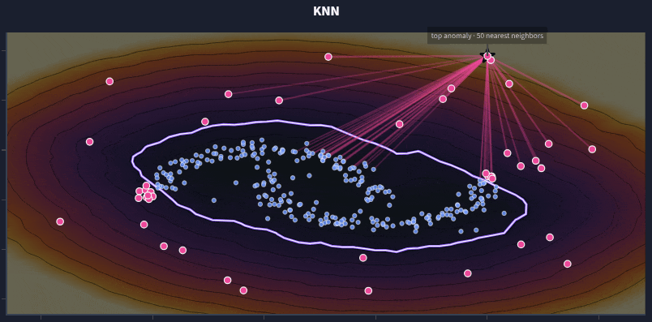
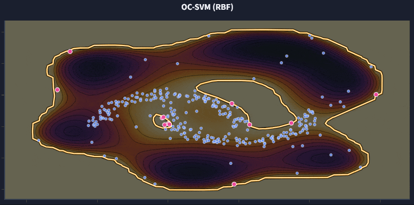

# Unsupervised Out-of-Distribution Detection on Smart-Home Event Streams

<p align="center">
  
  
</p>

[](https://www.python.org/)
[](https://scikit-learn.org)
[](scripts/verify_pipeline.py)
[](LICENSE)

## Overview

An unsupervised anomaly / out-of-distribution (OOD) detection project on smart-home
event streams (WSU CASAS), where there are **no anomaly labels**. Built in
**Python + Streamlit + Scikit-learn** on classical detectors (Z-Score, Isolation
Forest, MCD, HMM, Hawkes, Markov) instead of deep generative models.

**Live app**: [ood-detection-tradml.streamlit.app](https://ood-detection-tradml.streamlit.app/)
— a guided walkthrough with a 2-D teaching track and a CASAS track.

## Quick start

```bash
git clone https://github.com/a-egealopez/ood-detection-tradml.git
cd ood-detection-tradml
scripts/run.sh          # bootstrap venv, load data, launch the app (Linux/WSL)
```

`run.sh` / `run.bat` auto-detect the data source: real CASAS CSVs under `data/real/`
are used if present; on a fresh clone (no `data/`) the app falls back to synthetic
fixtures, so it works out of the box. Pass `--synthetic` or `--real` to force either.

## Motivation

A lot of image-based OOD work leans on deep generative models — diffusion model,
VAEs, foundation-model embeddings. I wanted to ask what happens when you drop all
of that and reach for the **classical detectors** instead. No neural nets, no
pretrained features — just the well-understood statistical methods (Z-Score,
Mahalanobis, MCD, Isolation Forest, KNN, OC-SVM, LOF) plus a few sequential ones
(HMM, Hawkes, Markov).

A smart-home stream is a great test bed because the sensor events carry no flag
for "this was an anomalous day." Anything you want to flag has to be found by
comparing a day against what the resident normally does. The CASAS datasets —
used for years in activity recognition and dementia research — give me real
structure, and a Markov stream generator gives me synthetic houses where the
order-based detectors have something to learn. The result is a framework that
lets a non-expert (future me, mostly) pick a detector, look at its behavior, and
understand when it works and when it doesn't.

<details>
<summary><b style="font-size:1.3em">Two tracks in the app</b></summary>

**Teaching track (2-D geometry)** — Scikit-learn datasets (`make_blobs`,
`make_moons`, `make_circles`, `make_swiss_roll`) with a known contamination rate.
The playground draws each detector's actual decision boundary on a mesh alongside
the training points, so the inductive bias of every method — axis-aligned bands
for Z-Score, ellipses for MCD, principal axes for PCA-reconstruction, iso-lines
for Isolation Forest, radial regions for OC-SVM — is directly observable.

**CASAS track (event-driven time series)** — the four CASAS houses (`aruba`,
`cairo`, `milan`, `tulum`) with synthetic fixtures the app self-provisions on
first launch.

*Using the real data (optional):* the four houses are published under CC-BY-4.0
(Cook, 2025, DOI: [10.5281/zenodo.17180309](https://doi.org/10.5281/zenodo.17180309)).
`scripts/fetch_casas_data.py` downloads `new_labeled_data.zip`, converts the raw
motion/door streams to `data/real/casas_{aruba,cairo,milan,tulum}_raw.csv` in the
loader's schema, and drops activity labels and temperature readings. `data/real/`
is gitignored; `run.sh`/`run.bat` pick it up automatically, or load it manually
with `python src/ingestion/casas_loader.py --source real`.

</details>

<details>
<summary><b style="font-size:1.3em">Repository layout</b></summary>

```
ood-detection-tradml/
├── app/                      # Streamlit UI (thin layer; no ML logic)
│   ├── views/
│   │   ├── playground_view.py        # 2-D decision-boundary visualizations
│   │   ├── casas_view.py             # CASAS track: config + results
│   │   └── feature_extraction_view.py
│   ├── streamlit_app.py
│   └── data_access.py / mesh.py / theme.py / references.py
├── src/                      # importable library (detectors, features, ...)
│   ├── config.py             # paths, constants, logging
│   ├── detectors/
│   │   ├── vectorial/        # ZScore, IsolationForest, Mahalanobis, ...
│   │   ├── sequential/       # HMM, Hawkes, Markov
│   │   ├── ensemble.py       # soft / hard voting
│   │   └── factory.py / base.py / constants.py
│   ├── features/             # event-driven extractors + FeatureScaler
│   ├── evaluation/           # metrics, event_injection, matrix_evaluation
│   ├── ingestion/            # casas_loader, markov_generator, sqlite_manager
│   ├── teaching/             # synthetic 2-D datasets
│   └── pipeline.py
├── scripts/                  # run.sh / run.bat, data fetch, eval CLIs, gates
├── tests/                    # pytest: unit/ + functional/
└── .opencode/skills/         # AI workflow (run-app, evaluate-models, ...)
```

</details>

<details>
<summary><b style="font-size:1.3em">Feature extractors</b></summary>

`src/features/event_driven_extractors.py` exposes four extractors, each targeting
a different anomaly family:

| Extractor | Detects |
|---|---|
| `TemporalFeatureExtractor` | contextual + collective (day level, 9 features) |
| `IntervalStatisticsExtractor` | point (raw intervals, CV / Fano factor) + collective |
| `NGramTransitionExtractor` | collective / sequence (first-order Markov, entropy) |
| `NextEventTransitionExtractor` | point + collective — predicts the next sensor and scores each transition by log-likelihood (DeepLog-style) |

</details>

<details>
<summary><b style="font-size:1.3em">Evaluation without labels</b></summary>

Real activity data carries no anomaly ground truth, so evaluation relies on a
**synthetic anomaly injection framework**. Three anomaly types are injected on
the **raw event stream** (never on the features), and the daily features are
re-extracted afterwards:

- **point** — a night burst of extra events from one sensor (a "loud" day);
- **contextual** — a whole day's routine circularly shifted by some hours;
- **collective** — the intra-day sensor order partially reversed (same events,
  same hours, different sequence);
- **control** — nothing injected; AUROC must stay ≈ 0.5.

This follows the point / contextual / collective taxonomy of Chandola et al.
(2009) and is why the sequential detectors (HMM, Hawkes, Markov) are in the
ensemble: a vectorial detector only sees marginal features, while a sequential
one catches order changes.

</details>

<details>
<summary><b style="font-size:1.3em">Results</b></summary>

Measured with `scripts/run_matrix.py --source synthetic --n-seeds 3` (AUROC on the
fixed 70/30 holdout; 210 cell-rows per house). Winner structure is consistent
across intensities:

| Anomaly type | Winners | Intuition |
|---|---|---|
| **point** | Z-Score, Mahalanobis, Isolation Forest, PCA ≈ **0.96–1.00** | a volume anomaly; distance and reconstruction families see it directly |
| **contextual** | Z-Score 1.00, Mahalanobis 0.98, PCA 0.96, HMM 0.97, Hawkes 0.83 | the routine moved in time; hourly-distribution and sequential models catch it |
| **collective** | **Markov Sequence 1.00**, rest ≤ 0.56 | counts preserved, only the transition structure changes — the order model is the unique winner |
| **control** | all ≈ **0.43–0.49** | no signal to leak; the pipeline is behaving |

**How it's measured.** With no ground truth, each result comes from injecting a
known anomaly into the raw stream of the test days, re-extracting features, and
scoring every detector on a clean 70/30 split — AUROC 1.0 is perfect, ~0.5 is a
coin flip. The `control` sits at ~0.5, confirming no signal leakage.

**Reproduce it.**

```bash
python scripts/generate_test_fixtures.py                 # create the synthetic houses
python scripts/run_matrix.py --source synthetic         # AUROC matrix + pivot CSV
python scripts/verify_pipeline.py --source synthetic    # all 31 gates (exit ≠ 0 on failure)
```

Use `--source real` (after `scripts/fetch_casas_data.py`) for the real CASAS homes.

</details>

<details>
<summary><b style="font-size:1.3em">Methodology</b></summary>

- **One contract for every detector**: `fit(X)` and
  `predict(X) -> (anomalies_0_1, scores_0_1)` with scores normalized to [0, 1], so
  the score-summing ensemble stays well-behaved.
- **No look-ahead**: the scaler and every detector fit on the clean 70% train
  days only; a fixed 70/30 split and a seeded HMM keep runs deterministic.
- **Per-detector inputs**: each detector gets the features it's built for — e.g.
  the Hawkes detector only the raw daily counts, since a Poisson score is valid
  for counts, not z-scored values.
- **Source-aware gates**: the collective (order-reversal) gate is enforced only
  when transitions are directional. `transition_asymmetry` is ≈ 0.35 on synthetic
  houses and 0.68–0.83 on real CASAS (below the 0.85 threshold); on near-symmetric
  data these gates become informational instead of failing.

</details>

<details>
<summary><b style="font-size:1.3em">Detectors</b></summary>

13 detector classes compose the public API (15 registered variants — OC-SVM is
registered per kernel and Isolation Forest has an `sliced_path` extended variant).

| Detector | Family | Basis |
|---|---|---|
| Z-Score | vectorial | thresholded univariate z-scoring |
| Mahalanobis | vectorial | covariance-aware distance to centroid |
| Elliptic Envelope / Robust Covariance | vectorial | minimum covariance determinant; Gaussian fallback on degenerate input |
| Isolation Forest / Extended IForest | vectorial | random-partition isolation; sliced paths for the extended variant |
| K Nearest Neighbors | vectorial | distance to k-th neighbor |
| OC-SVM (RBF / Linear / Poly) | vectorial | kernel support estimation |
| Local Outlier Factor | vectorial | local vs. neighbor density |
| PCA Reconstruction | vectorial | reconstruction error on the principal subspace |
| Hidden Markov Model | sequential | regime-change signal (seeded) |
| Hawkes | sequential | exponential-kernel self-exciting process (Ogata forward recursion in numpy) |
| Markov Sequence | sequential | first-order transition log-probability |

</details>

<details>
<summary><b style="font-size:1.3em">Testing & quality gates</b></summary>

68 pytest cases in `tests/` — `unit/` property tests plus `functional/` acceptance:

```bash
venv/bin/python -m pytest
```

`scripts/verify_pipeline.py --source synthetic` runs 31 gates — the pytest suite
plus the full anomaly-type × intensity × detector matrix — and exits non-zero on
any failure, so it drops into CI:

```bash
venv/bin/ruff check . --fix
venv/bin/pyright
venv/bin/vulture src/ app/ scripts/ --min-confidence 80
venv/bin/pip-audit
```

**AI-assisted development.** Day-to-day changes run through an opencode harness
backed by skills in `.opencode/skills/` (`run-app`, `evaluate-models`,
`generate-fixtures`, `code-conventions`). Every task maps to a skill that pins its
commands; every change must pass `ruff` + `pyright`; nothing counts as done until
`verify_pipeline.py` passes. Model logic stays in `src/`, importable outside the UI.

</details>

<details>
<summary><b style="font-size:1.3em">CLI</b></summary>

| Task | Command |
|---|---|
| Download real CASAS data | `python scripts/fetch_casas_data.py` (Zenodo, CC-BY-4.0) |
| Per-house evaluation report (real data) | `python scripts/run_evaluation.py --source real` |
| Type × intensity × detector matrix | `python scripts/run_matrix.py --source synthetic` |
| Verification gates (exit ≠ 0 on failure) | `python scripts/verify_pipeline.py --source synthetic` |
| Run tests | `venv/bin/python -m pytest` |

</details>

<details>
<summary><b style="font-size:1.3em">References</b></summary>

1. Chandola, V., Banerjee, A., and Kumar, V. **Anomaly Detection: A Survey.** *ACM Computing Surveys* 41(3), Article 15, 2009. doi:[10.1145/1541880.1541882](https://doi.org/10.1145/1541880.1541882).
2. Cook, D. J., Crandall, A. S., Thomas, B. L., and Krishnan, N. C. **CASAS: A Smart Home in a Box.** *IEEE Computer* 46(7):62–69, 2013. doi:[10.1109/MC.2012.328](https://doi.org/10.1109/MC.2012.328).
3. Cook, D. J. **CASAS Smart Home dataset (aruba, cairo, milan, tulum).** Zenodo, 2025. doi:[10.5281/zenodo.17180309](https://doi.org/10.5281/zenodo.17180309), CC-BY-4.0.
4. Liu, F. T., Ting, K. M., and Zhou, Z.-H. **Isolation Forest.** *Proc. 8th IEEE ICDM*, 413–422, 2008. doi:[10.1109/ICDM.2008.17](https://doi.org/10.1109/ICDM.2008.17).
5. Hawkes, A. G. **Spectra of Some Self-Exciting and Mutually Exciting Point Processes.** *Biometrika* 58(1):83–90, 1971. See also Ogata, Y., *Journal of the American Statistical Association* 83(401):9–27, 1988, for the forward-recursion likelihood this project implements in numpy.
6. Rabiner, L. R. **A Tutorial on Hidden Markov Models and Selected Applications in Speech Recognition.** *Proceedings of the IEEE* 77(2):257–286, 1989.
7. Du, M., Li, F., Zheng, G., and Srikumar, V. **DeepLog: Anomaly Detection and Diagnosis from System Logs through Deep Learning.** *Proc. ACM SIGSAC CCS*, 1285–1298, 2017. doi:[10.1145/3133956.3134015](https://doi.org/10.1145/3133956.3134015).

</details>

## License

MIT — see [LICENSE](LICENSE). Authors: [a-egealopez](https://github.com/a-egealopez).
